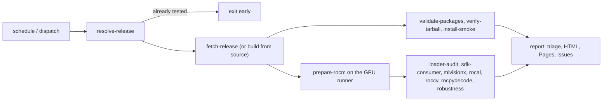

# vision-pack-test

Nightly functional QA for [vision-pack](https://github.com/kiritigowda/vision-pack), the AMD ROCm computer-vision extension pack (MIVisionX, rocAL, rocCV, rocPyDecode).

Every night this repository picks up vision-pack's newest `nightly-YYYYMMDD` prerelease and runs a deep test sweep on a real AMD GPU. vision-pack's own CI runs the four libraries' ctest suites on a CPU-only runner. This pipeline goes much further:

- package and loader audits;
- SDK consumer builds;
- Khronos OpenVX conformance on CPU and GPU;
- golden-image comparisons and CPU-vs-GPU parity harnesses;
- Python binding tests, robustness tests and performance tracking.

It then publishes a report and tracks known issues against new regressions, night over night.

## How it works



1. **`resolve-release`** finds the newest `nightly-*` release of `kiritigowda/vision-pack`.
   - It fingerprints the tag, the asset digests and the SDK name. If `qa-history/tested.txt` already contains that fingerprint, the run exits early.
   - It checks that the release target, the tag commit and the tarball manifest all name the same vision-pack commit.
2. **`fetch-release`** downloads the 16 DEBs, 16 RPMs and the dist tarball, and verifies them against the release's sha256 digests.
   - With `mode: build`, `build.yml` and `package.yml` build any vision-pack ref from source instead, mirroring upstream's build.
3. **Hosted jobs** validate every package (upstream's `validate_packages.sh` prints the "Package validation summary"), check the tarball, and install the DEBs/RPMs in clean containers against TheRock's nightly package repos.
4. **`prepare-rocm`** runs on the self-hosted runner:
   - It detects the GPU and fetches the matching TheRock `-tests` SDK for the manifest's SDK date (cached, sha256-checked).
   - It overlays the vision-pack tarball into one prefix under `/srv/vp-ci/runs/<run>/rocm`.
   - If the runner comes up without a usable GPU, the prefix uses vision-pack's own build SDK instead, and only the suites that need no GPU run (loader-audit, sdk-consumer, robustness-nogpu). Every GPU suite is reported as `<suite>::infra::no-gpu`, so the night is red with a single "runner had no usable GPU" reason and issue. It is not recorded as tested, so the next poll tries again.
   - If no self-hosted runner is registered at all (no `VP_HAS_SELF_HOSTED` repository variable), those same needs_gpu: false suites run on a GitHub-hosted runner instead, with the rest reported as `infra::no-gpu` exactly as above.
5. **GPU suites** run in Docker containers that see only the chosen GPU, with the prefix, dataset and repo mounted read-only.
6. **`report`** does the following:
   - classifies every result against `baselines/known_issues.yaml` and last night's results;
   - renders the HTML report, deploys it to GitHub Pages, and appends the night to the `qa-history` branch;
   - updates a rolling "Nightly QA status" issue and opens one issue per new regression.

A **red** run means a new failure, an infrastructure error, a crash or hang in a suite that passed before, fewer tests than expected, a hard performance regression or a new linkage leak. Known failures, flaky tests and fixed issues are **yellow**: they show in the report and summary but don't fail the run.

## Tiers

The tier names follow AMD TheRock's convention:

- **quick** (under 5 minutes, dispatch only): package checks, imports and ctest smoke tests.
- **standard** (under 30 minutes): adds loader-audit, header checks and every ctest suite.
- **comprehensive** (the nightly default): everything except the Khronos optional tests, extended Python frameworks and the full performance gate.
- **full** (weekly on Sunday, or by dispatch): adds the conformance optional tests, extended dependencies (ROCm torch, tensorflow, jax), the performance gate, and the standalone-tarball, RPM and package-install scenarios.

`suites/suites.yaml` lists which suites run in which tier, their timeouts and their runner.

## Setup

1. **Runner:** follow [runner/README.md](runner/README.md) on the dedicated GPU machine. It covers the driver, `setup.sh`, the pre-job hook and the security model.
2. **Repository settings:**
   - Actions → General:
     - require approval for all external contributors;
     - read-only default `GITHUB_TOKEN`;
     - optionally require SHA-pinned actions;
     - allow GitHub Actions to create pull requests (only needed for `image.yml`'s digest-lock PR).
   - Rules: protect `main`.
   - Pages: source **GitHub Actions**.
3. **Test images:** by default the runner builds them from `docker/` (tagged by content hash, reused until `docker/` changes). To use published images, run `image.yml`, make its GHCR packages public (or grant the repository read access), and merge the PR that pins their digests in `docker/images.lock`.
4. **Optional repository variables:**
   - `EXPECTED_GFX` (e.g. `gfx1201`): fail if the runner's GPU changes.
   - `VP_HAS_SELF_HOSTED=true`: a self-hosted runner (`vp-gpu` and/or `vp-cpu`) is registered. Until you set this, `loader-audit`/`sdk-consumer`/`robustness-nogpu` run on a GitHub-hosted runner instead (no persistent SDK cache), and every GPU suite is `infra::no-gpu`; set it once `runner/setup.sh` has registered a runner, GPU or not.
   - `VP_HAS_CPU_RUNNER=true`: a `vp-cpu` runner instance exists, so run the CPU-only suites on it in parallel.
   - `VP_COMMIT_PIN=true`: commit the tested submodule pin back to `main` after each night. This is off by default, because it conflicts with a protected `main`.
   - `VP_IMAGE_TEST` / `VP_IMAGE_MEDIA`: a digest-pinned image reference that overrides `docker/images.lock`.
5. **Optional secrets:** `SLACK_WEBHOOK_URL`, and `TEAMS_WEBHOOK_URL` (a Teams Workflows webhook). These notify only when the verdict colour changes.
6. **First run:** Actions → nightly → Run workflow with `tier: quick`, then `tier: comprehensive`.

## Running manually

`nightly.yml` accepts these `workflow_dispatch` inputs:

| Input | Default | Meaning |
|---|---|---|
| `mode` | `release` | `release` tests a published nightly; `build` builds `vision_pack_ref` from source |
| `release_tag` | newest | A specific `nightly-YYYYMMDD` tag |
| `vision_pack_ref` | `main` | Branch or SHA for `mode: build` |
| `tier` | `comprehensive` | `quick`, `standard`, `comprehensive` or `full` |
| `suites` | all | Comma-separated subset, e.g. `rocal,roccv` |
| `extended_deps` | `false` | Use the extended image (ROCm torch, tensorflow, jax) |
| `rocm_sdk_family` / `rocm_sdk_date` / `rocm_sdk_url` | auto | Override the runtime SDK selection |
| `force` | `false` | Re-test even if this release was already tested |

## Running a suite locally

Any suite can run directly on a machine that already has a ROCm + vision-pack prefix, without Docker:

```bash
build_tools/local_run.sh --suite roccv --prefix /opt/rocm-nightly --data /path/to/MIVisionX-data \
    --tier standard --out ./out
python3 report/triage.py --results ./out --known baselines/known_issues.yaml --site ./site
```

Open `./site/index.html` to see the same report the nightly publishes.

## Triage and baselines

- `baselines/known_issues.yaml` holds the known findings:
  - C1–C2, H1–H19 and M1–M23 from the manual QA report of 25 Sep 2026 (M4 was fixed in `nightly-20260926` and removed);
  - low-severity items;
  - provisional findings N1–N14, found while planning and porting the suites.

  Long exact ID lists live in `baselines/lists/`.
  - Each entry has match globs, a GPU scope, an owner, an issue link and a `review_by` date.
  - Lint fails once a `review_by` date passes.
  - A known failure that starts passing is reported as fixed.
- `baselines/expected_counts.yaml` catches silently dropped tests (e.g. rocAL must register 21 ctests).
- `baselines/perf_policy.yaml` defines the rolling performance gate.
- [docs/triage.md](docs/triage.md) explains how to read a report and update the baselines. [docs/test-plan.md](docs/test-plan.md) lists every check with its pass criterion.

## Repository layout

```text
.github/workflows/  nightly.yml (orchestrator), test.yml, report.yml, build.yml, package.yml,
                    image.yml, lint.yml, keepalive.yml
build_tools/        resolve_release.py, fetch_release.sh, pin_submodule.sh, detect_gpu.sh,
                    prepare_rocm.sh, ensure_image.sh, run_in_container.sh, ci_run_suite.sh,
                    preflight.sh, ctest_junit.sh, local_run.sh, plan_matrix.py,
                    build_vision_pack.sh / package_vision_pack.sh (build mode),
                    lint_known_issues.py, lib/vp.sh (suite helpers),
                    results/ (emit, merge, CTS log conversion)
suites/             one directory per suite, each with run.sh; suites.yaml (tier matrix)
baselines/          known_issues.yaml, expected_counts.yaml, perf_policy.yaml
report/             triage.py, generate_report.py, template.html, publish_history.py
docker/             test images (test, media, extended), hash-pinned requirements, images.lock
runner/             self-hosted runner bootstrap and hooks
docs/               suite contract, test plan, triage guide
tests/              unit tests for the tooling (run by lint.yml)
vision-pack/        submodule (tracks main; pinned to the tested release at run time)
```

## Relationship to vision-pack

vision-pack is a submodule, and jobs check it out at the tested release's commit. In release mode, only its top level is used: `build_tools/fetch_rocm_sdk.py` resolves SDK tarballs, and `build_tools/validate_packages.sh` validates the DEBs. Nested library submodules are initialised only for build mode and for the few full-tier steps that need upstream sources (rocCV benchmarks). This repository never patches vision-pack; findings go upstream as issues, with the reproducers the report links to.
